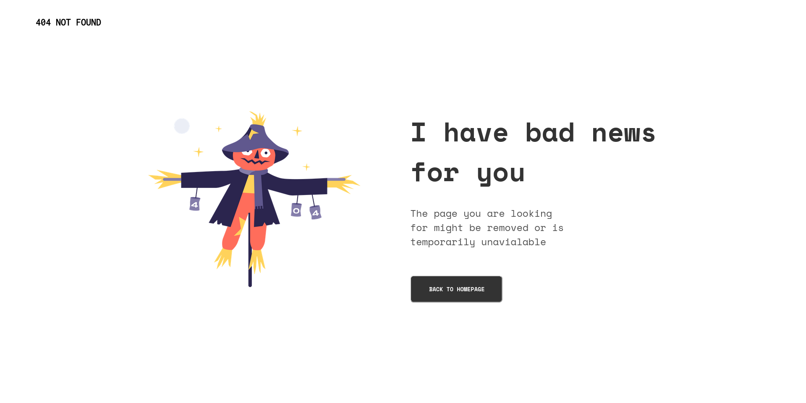

<!-- Please update value in the {}  -->

<h1 align="center">404-NotFound</h1>

  <h3>
    <a href="https://heikrana.github.io/devchallenges-404NotFound/">
      Demo
    </a>
     | 
    <a href="https://devchallenges.io/challenges/wBunSb7FPrIepJZAg0sY">
      Challenge
    </a>
  </h3>

<!-- TABLE OF CONTENTS -->

## Table of Contents

-   [Screenshot](#overview)
-   [Features](#features)
-   [Contact](#contact)

<!-- OVERVIEW -->

## Features

Responsive design for mobile but not for tablets as of now :(

## Contact

-   Website [Work in Progress](https://heikrana.github.io/devchallenges-404NotFound/)
-   Twitter [@heikrana](https://twitter.com/heikrana)
-   Linkedin [@heikrana](https://linkedin.com/in/heikrana)
